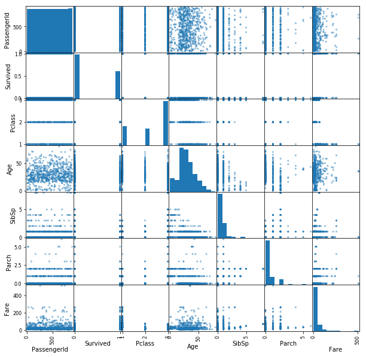

## Exploratory Data Analysis
Typically, whenever we are handed a new dataset or problem our first step is to begin to wrap our head around the problem and the data associated with it. This is where some of our previous tools such as the measure of center and dispersion will come in handy. From there, we can continue to dissect the problem by employing various techniques and algorithms to further analyze the dataset from various angles.  
  
### Here we'll investigate a classic dataset concerning the Titanic.

#### First let's import the dataset, see how long it is and preview the first 5 rows


```python
import pandas as pd
```


```python
df = pd.read_csv('train.csv')
print(len(df))
df.head()
```

    891


<div>
<style scoped>
    .dataframe tbody tr th:only-of-type {
        vertical-align: middle;
    }

    .dataframe tbody tr th {
        vertical-align: top;
    }

    .dataframe thead th {
        text-align: right;
    }
</style>
<table border="1" class="dataframe">
  <thead>
    <tr style="text-align: right;">
      <th></th>
      <th>PassengerId</th>
      <th>Survived</th>
      <th>Pclass</th>
      <th>Name</th>
      <th>Sex</th>
      <th>Age</th>
      <th>SibSp</th>
      <th>Parch</th>
      <th>Ticket</th>
      <th>Fare</th>
      <th>Cabin</th>
      <th>Embarked</th>
    </tr>
  </thead>
  <tbody>
    <tr>
      <th>0</th>
      <td>1</td>
      <td>0</td>
      <td>3</td>
      <td>Braund, Mr. Owen Harris</td>
      <td>male</td>
      <td>22.0</td>
      <td>1</td>
      <td>0</td>
      <td>A/5 21171</td>
      <td>7.2500</td>
      <td>NaN</td>
      <td>S</td>
    </tr>
    <tr>
      <th>1</th>
      <td>2</td>
      <td>1</td>
      <td>1</td>
      <td>Cumings, Mrs. John Bradley (Florence Briggs Th...</td>
      <td>female</td>
      <td>38.0</td>
      <td>1</td>
      <td>0</td>
      <td>PC 17599</td>
      <td>71.2833</td>
      <td>C85</td>
      <td>C</td>
    </tr>
    <tr>
      <th>2</th>
      <td>3</td>
      <td>1</td>
      <td>3</td>
      <td>Heikkinen, Miss. Laina</td>
      <td>female</td>
      <td>26.0</td>
      <td>0</td>
      <td>0</td>
      <td>STON/O2. 3101282</td>
      <td>7.9250</td>
      <td>NaN</td>
      <td>S</td>
    </tr>
    <tr>
      <th>3</th>
      <td>4</td>
      <td>1</td>
      <td>1</td>
      <td>Futrelle, Mrs. Jacques Heath (Lily May Peel)</td>
      <td>female</td>
      <td>35.0</td>
      <td>1</td>
      <td>0</td>
      <td>113803</td>
      <td>53.1000</td>
      <td>C123</td>
      <td>S</td>
    </tr>
    <tr>
      <th>4</th>
      <td>5</td>
      <td>0</td>
      <td>3</td>
      <td>Allen, Mr. William Henry</td>
      <td>male</td>
      <td>35.0</td>
      <td>0</td>
      <td>0</td>
      <td>373450</td>
      <td>8.0500</td>
      <td>NaN</td>
      <td>S</td>
    </tr>
  </tbody>
</table>
</div>


#### Then let's quickly get some more info about each of our column features:


```python
df.info()
```

    <class 'pandas.core.frame.DataFrame'>
    RangeIndex: 891 entries, 0 to 890
    Data columns (total 12 columns):
    PassengerId    891 non-null int64
    Survived       891 non-null int64
    Pclass         891 non-null int64
    Name           891 non-null object
    Sex            891 non-null object
    Age            714 non-null float64
    SibSp          891 non-null int64
    Parch          891 non-null int64
    Ticket         891 non-null object
    Fare           891 non-null float64
    Cabin          204 non-null object
    Embarked       889 non-null object
    dtypes: float64(2), int64(5), object(5)
    memory usage: 83.6+ KB


#### We can also quickly visualize the data:
Along the diagonal are the distributions for each of our variables. Every other cell shows a correlation plot of one feature against another feature.


```python
%matplotlib inline
```


```python
pd.plotting.scatter_matrix(df, figsize=(10,10));
```





# Create a graph displaying the distribution of those who survived
(Any appropriate graph works including pie chart or bar chart or other appropriate.) 


```python
#Your code here
```

# Create a graph depicting the survival distribution by gender.


```python
#Your code here
```

# Create a graph depicting survival by age


```python
#Your code here
```

# Create a new colmn age bracket with the following categories:
* 0-12 years old
* 12-18 years old
* 18-25 years old
* 25-35 years old
* 35-45 years old
* 45-65 years old
* 65+ years old


```python
#Your code here
```

# Create a graph displaying the distribution of those who survived by the age brackets created above


```python
#Your code here
```

# Explore at least 3 other relationships within the data.


```python
# Your code here
```


```python
# Your code here
```


```python
# Your code here
```
